# Mission: Possible 🌏✈️

> **A travel and catering operations platform for MHFA Australia**


---

## 🎯 Overview

**Mission: Possible** is a purpose-built web application designed to streamline travel and catering request management for Mental Health First Aid (MHFA) Australia. It replaces the current manual process of email chains, phone calls, and monday.com boards with a unified, modern platform.

### Why "Mission: Possible"?

The name reflects our commitment to making what was once a complex, time-consuming mission — coordinating travel approvals, vendor quotes, bookings, and reconciliation — into something seamless and delightful.

---

## 🛠️ Tech Stack

| Layer | Technology |
|-------|-----------|
| **Frontend** | Vanilla HTML, CSS, JavaScript (no framework) |
| **Database** | [Supabase](https://supabase.com) (PostgreSQL + Realtime) |
| **Auth** | Application-level RBAC with SHA-256 password hashing |
| **Hosting** | [Vercel](https://vercel.com) |
| **Source Control** | GitHub |

---

## 👥 User Roles

| Role | Description | Primary Actions |
|------|-------------|-----------------|
| **Employee** | Any MHFA staff member | Submit requests, review options, track status |
| **Ops Coordinator** | Operations team | Triage, coordinate, book, document |
| **Approver** | Executive Directors, CEO | Review and approve/reject requests |
| **Vendor** | External partners (e.g. Flight Centre) | View assigned requests, upload quotes |
| **Admin** | System administrator | Manage users, roles, and system settings |

---

## 🔄 The Workflow

```mermaid
stateDiagram-v2
  [*] --> SUBMITTED: Employee submits request
  SUBMITTED --> TRIAGE: Ops begins review
  TRIAGE --> AWAITING_APPROVAL: Ready for approval
  AWAITING_APPROVAL --> APPROVED: ✅ Approved
  AWAITING_APPROVAL --> REJECTED: ❌ Rejected
  APPROVED --> QUOTING: Ops requests vendor quotes
  QUOTING --> OPTION_REVIEW: Options ready
  OPTION_REVIEW --> BOOKED: Selection confirmed
  BOOKED --> ITINERARY_SENT: Documents uploaded
  ITINERARY_SENT --> INVOICED: Invoice received
  INVOICED --> RECONCILED: Finance reconciles
  RECONCILED --> CLOSED: ✨ Complete!
```



---

## 🚀 Getting Started

### Prerequisites

- A [Supabase](https://supabase.com) project
- A [Vercel](https://vercel.com) account (for hosting) or any static file server

### Local Development

1. **Clone the repository**
   ```bash
   git clone https://github.com/ken826/mission-possible-travel.git
   cd mission-possible-travel
   ```

2. **Configure environment**

   Edit the `<meta>` config tags in `app/index.html` with your own Supabase and Firebase credentials:
   ```html
   <meta name="config:supabase-url" content="YOUR_SUPABASE_URL">
   <meta name="config:supabase-anon-key" content="YOUR_SUPABASE_ANON_KEY">
   ```

   > ⚠️ **Never commit real API keys to a public repository.** For production, inject these values server-side or via environment variables through your hosting platform.

3. **Set up the database**

   Run the SQL in `supabase-setup.sql` in your Supabase project's SQL Editor to create the required tables (`users`, `requests`, `notifications`).

4. **Serve locally**

   Open `app/index.html` directly in a browser, or use any local server:
   ```bash
   npx serve app
   ```

5. **Default users**

   The app will auto-seed default user accounts on first load when the `users` table is empty. Contact the project admin for credentials.

### Deploying to Vercel

The project includes a `vercel.json` for zero-config deployment:

```bash
npx vercel --prod
```

Vercel will serve the `app/` directory as a static site.

---

## 🔒 Security

- **API keys** are loaded at runtime from `<meta>` tags — not hardcoded in JavaScript source
- **Passwords** are hashed with SHA-256 before storage (via Web Crypto API)
- **Content Security Policy** (CSP) is set via meta tag
- **XSS prevention** via `escapeHtml()` utility for user-generated content
- **RBAC** with permission-based access control

---

## 📚 Architecture Decision Records (ADRs)

| ADR | Title | Status |
|-----|-------|--------|
| [ADR-001](docs/adr/adr-001.md) | Build a Dedicated Travel & Catering Operations Application | ✅ Accepted |
| [ADR-002](docs/adr/adr-002.md) | Unified Request Model with Typed Extensions | ✅ Accepted |
| [ADR-003](docs/adr/adr-003.md) | Explicit Workflow State Machine with Ownership and SLAs | ✅ Accepted |
| [ADR-004](docs/adr/adr-004.md) | Policy-Driven Approval Routing with Delegation | ✅ Accepted |
| [ADR-005](docs/adr/adr-005.md) | Internal-First Design with Optional External Partner Access | ✅ Accepted |
| [ADR-006](docs/adr/adr-006.md) | Request Timeline as the Primary Communication Record | ✅ Accepted |
| [ADR-007](docs/adr/adr-007.md) | Notification Strategy with App as Source of Truth | ✅ Accepted |
| [ADR-008](docs/adr/adr-008.md) | Structured Document and Invoice Management | ✅ Accepted |
| [ADR-009](docs/adr/adr-009.md) | Role-Based Access Control and Auditing | ✅ Accepted |
| [ADR-010](docs/adr/adr-010.md) | Technology Stack and Deployment Strategy | ✅ Accepted |
| [ADR-011](docs/adr/adr-011.md) | UI/UX Design Principles and Branding | ✅ Accepted |


---

## 🏗️ Implementation Epics

| Epic | Focus | Key Deliverables |
|------|-------|------------------|
| **E1** | [Foundations & RBAC](docs/epics/epic-e1-foundations-rbac.md) | App shell, authentication, roles, audit framework |
| **E2** | [Request Intake](docs/epics/epic-e2-request-intake.md) | Travel & catering submission forms, data model |
| **E3** | [Workflow Engine](docs/epics/epic-e3-workflow-engine.md) | State machine, timeline, ops actions |
| **E4** | [Approvals & Routing](docs/epics/epic-e4-approvals-routing-delegation.md) | Policy engine, delegation, approver inbox |
| **E5** | [Quoting & Booking](docs/epics/epic-e5-quoting-review-booking.md) | Quote options, requester review, document handling |
| **E6** | [Finance & Polish](docs/epics/epic-e6-finance-reconciliation.md) | Reconciliation, exports, notification refinement |

---

## 🎨 Design System

Mission: Possible follows the **MHFA Australia Brand Guidelines 2024**, featuring:

- **Primary Colours**: MHFA Dark Green `#00573D`, MHFA Green `#00AA52`
- **Typography**: Clean, accessible fonts (Inter)
- **Design Ethos**: Calm, professional, reassuring — reflecting the organisation's mental health focus

See [brand-colours-mhfa.md](docs/branding/brand-colours-mhfa%20copy.md) for the full colour palette.

---

## 📐 Domain Model


See [domain-model-diagram.md](docs/mermaid/domain-model-diagram.md) for the complete entity relationship diagram.

---

## 📞 Support

For questions about this project, contact the development team.

---

<div align="center">
  <em>Making travel management a mission that's always possible.</em>
</div>
